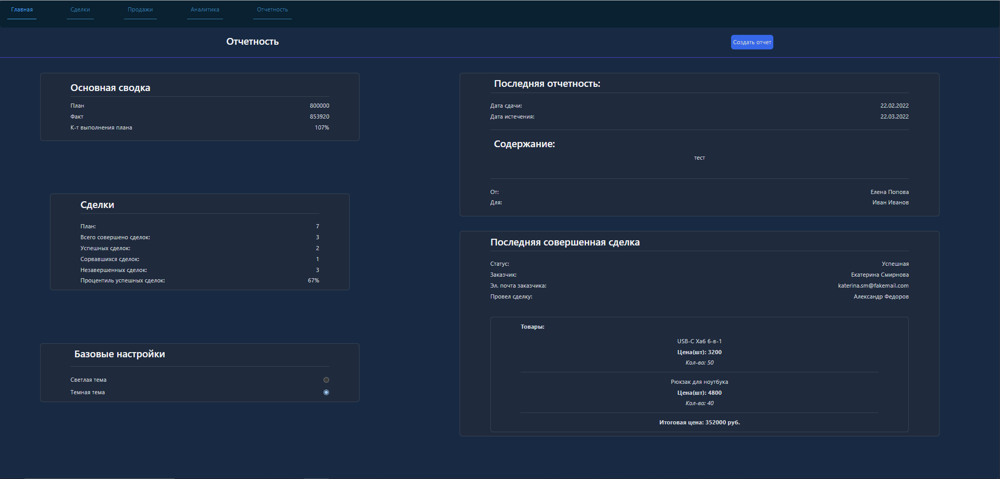
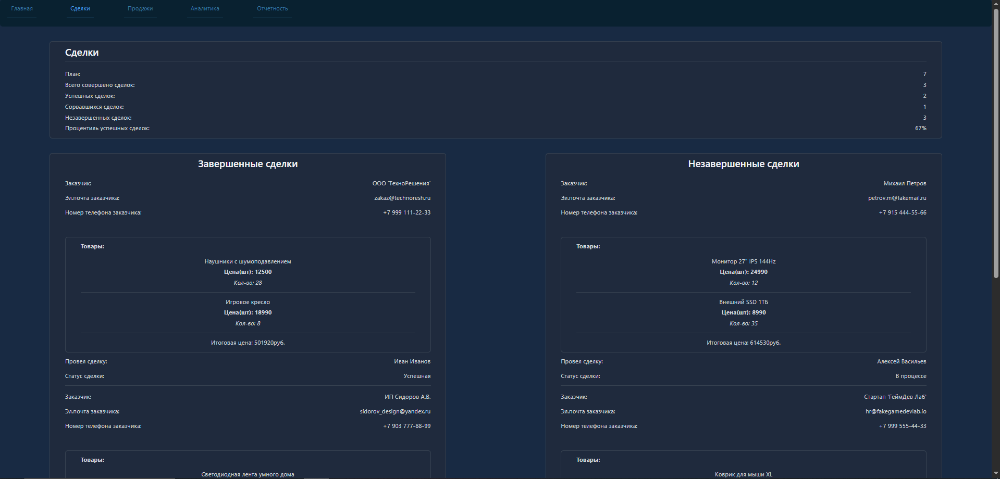
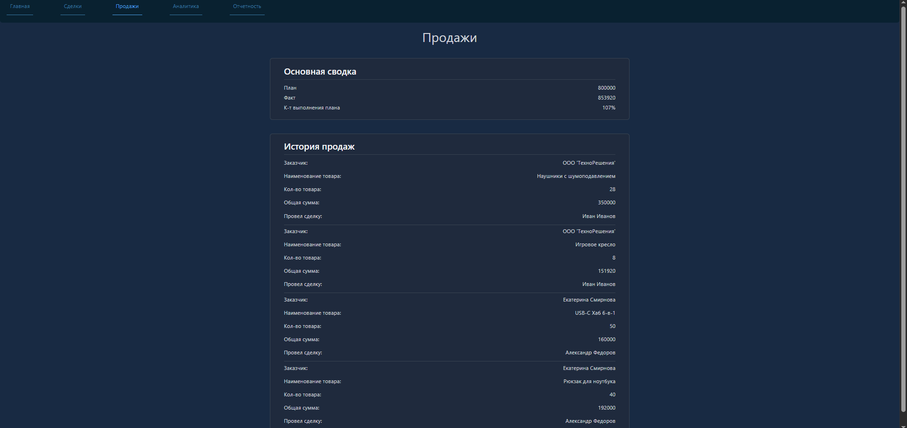
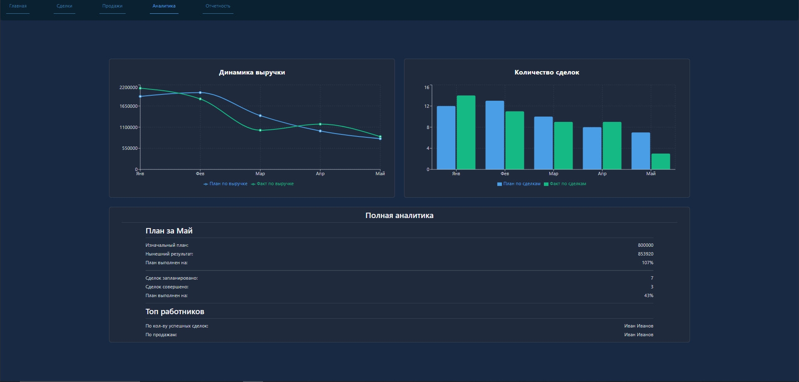
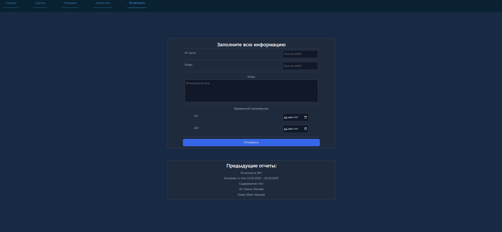

# 📋 CRM-система для учета сделок и отчетов

**Fullstack CRM-приложение** для управления сделками, продажами, товарами и внутренней отчетностью. Проект построен на связке **React (TypeScript + Zustand)** + **Node.js (Express)** с использованием **PostgreSQL** как базы данных.

---

## 🖼️ Скриншоты







---

## 🚀 Стек технологий

| Компонент | Технологии |
|-----------|------------|
| **Frontend** | React, TypeScript, Zustand (стейт-менеджер), Axios, TailwindCSS, react-router |
| **Backend** | Node.js, Express, ES6 Modules (`import/export`), nodemon, `pg` (PostgreSQL клиент) |
| **База данных** | PostgreSQL (базы: `CRM`, таблицы: `deals`, `deal_items`, `employees`, `goods`, `reports`) |
| **State Management** | Zustand (иммутабельное обновление UI, hooks-based API) |

---

## ⚙️ Особенности архитектуры и логики

1. **PostgreSQL + Node.js backend**: Backend использует `pg` клиент для работы с реальной базой PostgreSQL вместо JSON-файлов. Подключение через `.env` с проверкой связи.

2. **Отказоустойчивое чтение БД**: Бэкенд застрахован от ошибок подключения. Если база недоступна, сервер возвращает ошибку `500` с понятным message.

3. **Иммутабельное обновление UI**: При отправке нового отчета Zustand-стор валидирует индикатор загрузки (`loading: true`), делает POST-запрос и мгновенно дописывает новый отчет в массив без повторного GET-запроса.

4. **Безопасный рендеринг**: React-компонент использует безопасный обход массива с явным возвратом JSX-элементов, предотвращая появление пустых (`undefined`) элементов на экране.

5. **Чистая архитектура Fullstack**: Frontend не знает о PostgreSQL — только о REST API. Backend как отдельный микросервис на порту `5000`.

6. **Адаптивность и тема**: Смена светлой/темной темы через Zustand, адаптивность под мобильные устройства и Tablet.

---

## 🗂️ Эндпоинты API (Backend)

### `GET /api/deals`
- **Описание**: Получение списка всех сделок + items из `deal_items`.
- **Формат ответа**:
```json
{
  "deals": [
    {
      "id": 101,
      "client_name": "ООО 'ТехноРешения'",
      "client_email": "zakaz@technoresh.ru",
      "client_phone": "+7 999 111-22-33",
      "deal_status": "successful",
      "dealer_id": 1
    }
  ],
  "items": [
    {
      "id": 1,
      "deal_id": 101,
      "good_id": 4,
      "price": 12500,
      "quantity": 28
    }
  ]
}
```

### `POST /api/deals`
- **Описание**: Создание новой сделки в PostgreSQL + синхронизация с CRM.
- **Тело запроса**:
```json
{
  "client_name": "ООО 'ТехноРешения'",
  "client_email": "zakaz@technoresh.ru",
  "client_phone": "+7 999 111-22-33",
  "deal_status": "current",
  "dealer_id": 1
}
```
- **Валидация**: Сервер возвращает `400 Bad Request`, если тело пустое.

### `GET /api/employees`
- **Описание**: Получение списка сотрудников.
- **Формат ответа**: `[ { "id": 1, "name": "Иван", "last_name": "Иванов", "position": "Менеджер", ... } ]`

### `GET /api/goods`
- **Описание**: Получение списка товаров.
- **Формат ответа**: `[ { "id": 1, "name": "Наушники", "desc": "Bluetooth...", "price": 12500 } ]`

### `GET /api/reports`
- **Описание**: Получение списка отчетов.
- **Формат ответа**: `[ { "wasWritten": "...", "expiresAt": "...", "report": "...", "from": "...", "to": "..." } ]`

### `POST /api/reports`
- **Описание**: Создание нового отчета.
- **Тело запроса**:
```json
